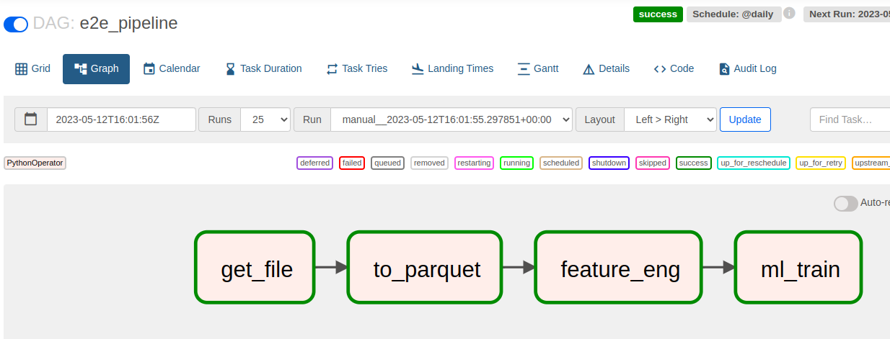

# riskthinking_assesment

## Deployment Instructions

### Airflow deployment

Once the repository has been cloned to a host machine. From the root directory run the following commands from a terminal.

`cd riskthinking_assesment/airflow_docker/`

`docker build . --tag airflow_ext:latest`

`docker compose up airflow-init`

`docker compose up`

This will initiate the airflow deployment. 

### Flask Server deployment

The flask server is deployed on Heroku and the predict endpoint can be accessed at :
To build and run the flask deployment on a local envionment run the following commands from a terminal, starting at the root directory of this repository.

`cd riskthinking_assesment/flask-server/`

`docker compose up`

## Pipeline DAG 

  

### Task : get_file

Downloads the zip file containing data and extracts the data.

#### Further Improvements
- Automate file link extraction

### Task : to_parquet

Extracts the .csv for each stock and etf and converts each file to a parquet file.

To convert all the stocks and etf to parquet files and eventually generate ml models for each stock and etf.
Set the following environment variable to True.
`IS_RUN_ALL_FILES: False` , this environment variable can be set in the `docker-compose.yaml` file.
### Task : feature_eng

Performs the required feature engineering.

### Task : ml_train

Trains an XGBoost Regression model to predict the traded volume, this is done per stock and etf.

#### Further Improvements
- Perform Cross validation 
- Hyperparameter Optimization with Grid Search

## Flask Server

The flask server is deployed on Heroku, and can be accessed at : https://hidden-wave-83408.herokuapp.com

To obtain a prediction for the volume from the trained model, call the following url with the parameters for the moving average volume and closing rolling median, as follows.

https://hidden-wave-83408.herokuapp.com/predict?vol_moving_avg={}&adj_close_rolling_med={}

e.g:

https://hidden-wave-83408.herokuapp.com/predict?vol_moving_avg=62546300&adj_close_rolling_med=100